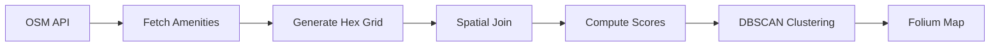

# Cairo Hex Grid Analysis 🗺️

[](https://www.python.org/downloads/)
[](https://opensource.org/licenses/MIT)
[](https://github.com/astral-sh/ruff)

Hexagonal grid analysis of urban amenities using OpenStreetMap data. Generate service coverage maps, identify hotspots, and visualize spatial patterns for any city.

**[🌐 Live Demo →](https://cairo-hex-analysis-by-ammaryasser.netlify.app/)**

---

## Features

- 📥 **OSM Integration** – Download amenities directly from OpenStreetMap
- ⬡ **Hex Grid Generation** – Create projected hexagonal grids in any CRS
- 📊 **Service Scoring** – Compute density and diversity metrics per cell
- 🔥 **Hotspot Detection** – Find clusters using DBSCAN algorithm
- 🗺️ **Interactive Maps** – Generate Folium maps with layers and tooltips

## Quick Start

### Installation

```bash
# Clone the repository
git clone https://github.com/AmmarYasser455/Cairo-Hex-Grid-Analysis-using-Python.git
cd Cairo-Hex-Grid-Analysis-using-Python

# Create virtual environment (recommended)
python -m venv .venv
source .venv/bin/activate  # Windows: .venv\Scripts\activate

# Install the package
pip install -e .
```

> **Note**: For easier geospatial dependency installation, consider using conda:
> ```bash
> conda create -n hexenv python=3.10 -y && conda activate hexenv
> conda install -c conda-forge geopandas osmnx folium shapely scikit-learn -y
> pip install -e .
> ```

### Run Analysis

```bash
# Default: Cairo, Egypt with 400m hex radius
python run_analysis.py

# Custom location and settings
python run_analysis.py --place "Alexandria, Egypt" --radius 300 --output output/
```

### CLI Options

| Option | Default | Description |
|--------|---------|-------------|
| `--place` | "Cairo, Egypt" | Location to analyze |
| `--radius` | 400 | Hex radius in meters |
| `--output` | output/ | Output directory |
| `--dbscan-eps` | 200 | DBSCAN cluster distance (m) |
| `--dbscan-min-samples` | 3 | Min points per cluster |

## Output Files

| File | Description |
|------|-------------|
| `cairo_hexgrid.geojson` | Hex cells with count, diversity, density, score |
| `hotspots.geojson` | Detected cafe cluster centroids |
| `cairo_hex_map.html` | Interactive Folium map |

## Project Structure

```
Cairo-Hex-Grid-Analysis/
├── src/hexanalysis/         # Core package
│   ├── __init__.py          # Package exports
│   ├── config.py            # Configuration dataclass
│   ├── hexgrid.py           # Hex grid generation
│   ├── analysis.py          # Score computation & clustering
│   ├── osm.py               # OSM data fetching
│   ├── visualization.py     # Folium map creation
│   └── cli.py               # Command-line interface
├── tests/                   # Pytest tests
├── run_analysis.py          # Entry point script
├── pyproject.toml           # Package configuration
└── requirements.txt         # Pinned dependencies
```

## Package API

```python
from hexanalysis import (
    Config,
    fetch_area,
    fetch_amenities,
    create_hex_grid_gdf,
    aggregate_amenities,
    compute_scores,
    detect_hotspots,
    create_map,
)

# Configure analysis
config = Config(place_name="Giza, Egypt", hex_radius_m=500)

# Fetch data
area = fetch_area(config.place_name)
amenities = fetch_amenities(config.place_name, config.amenity_types)

# Build hex grid and analyze
hex_gdf = create_hex_grid_gdf(area, config.hex_radius_m)
hex_gdf = aggregate_amenities(amenities.to_crs(epsg=3857), hex_gdf)
hex_gdf = compute_scores(hex_gdf)

# Find hotspots
hotspots = detect_hotspots(amenities.to_crs(epsg=3857), "cafe")

# Create interactive map
m = create_map(hex_gdf.to_crs(4326), amenities, hotspots.to_crs(4326), area)
m.save("map.html")
```

## Development

```bash
# Install dev dependencies
pip install -e ".[dev]"

# Run tests
pytest tests/ -v

# Lint and format
ruff check src/
ruff format src/
```

## How It Works



1. **Fetch Data**: Downloads amenities within the specified place boundary
2. **Build Grid**: Creates flat-top hexagons in EPSG:3857 (Web Mercator)
3. **Aggregate**: Counts amenities and unique types per hex cell
4. **Score**: Normalizes density + diversity with configurable weights
5. **Cluster**: Identifies cafe hotspots using DBSCAN on projected coordinates
6. **Visualize**: Generates an interactive map with heatmap, hex layer, and markers

## License

MIT License – see [LICENSE](LICENSE) for details.

---

Made with ❤️ by [Ammar Yasser](https://github.com/AmmarYasser455)
